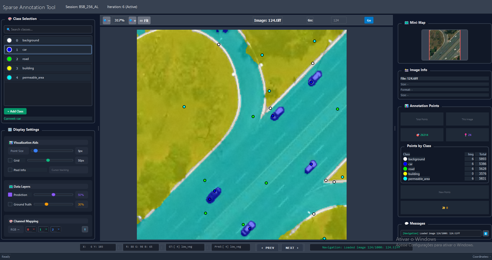

# SIAL: Sparse Annotation Framework for Semantic Segmentation via Iterative Active Learning

A framework for training semantic segmentation models using minimal point annotations through iterative active learning.

> **Note:** This paper has been submitted to **IEEE Journal of Selected Topics in Applied Earth Observations and Remote Sensing (JSTARS)** and is currently under review.

## Overview

SIAL enables training high-quality segmentation models with extremely sparse supervision: **only 1 pixel per class per image per iteration** (~0.01% of dense labeling). The key idea is **error-driven active learning**: instead of labeling random pixels, the annotator identifies and corrects model prediction errors iteratively.

### Framework


The iterative cycle:
1. **Annotate**: Add one point per class per image (sparse supervision)
2. **Train**: Train segmentation model using Error-Weighted Dice Loss (EWDL)
3. **Predict**: Generate predictions on training images
4. **Review**: Human identifies prediction errors
5. **Repeat**: Add new points on error regions → back to step 2

### Annotation Software



The annotation tool displays:
- RGB image with prediction overlay
- Class selection panel (left)
- Point annotations as colored dots
- Mini-map for navigation (right)
- Annotation statistics per class

## Key Contributions

- **Error-driven selection**: Target prediction errors, not random/uncertain pixels
- **Extreme sparsity**: 1 pixel per class per image (~25 pixels total per image)
- **Error-Weighted Dice Loss (EWDL)**: Amplifies learning from misclassified regions
- **Complete pipeline**: Annotation tool + training workflow in a single framework

## Results

### Multiclass Segmentation (ISPRS Vaihingen)
| Method | mIoU | Labeling Cost |
|--------|------|---------------|
| Full Supervised | 71.62% | 100% |
| EasySeg (SOTA) | 72.83% | 0.015% |
| **SIAL (Ours)** | **73.63%** | **0.009%** |

### Binary Segmentation (BSB Aerial Dataset)
| Class | Dense | SIAL (6 iter) | Random |
|-------|-------|---------------|--------|
| Car | 76.52% | 72.29% | 39.74% |
| Road | 89.27% | 86.46% | 77.07% |
| Building | 86.46% | 80.55% | 73.06% |
| Perm. Area | 90.96% | 88.13% | 85.13% |

SIAL achieves **~95% of dense performance** using only **~0.01%** of labeled pixels.

## Installation

```bash
git clone https://github.com/osmarluiz/SIAL.git
cd SIAL
pip install -r requirements.txt
```

### Requirements
- Python 3.8+
- PyTorch 1.10+
- PyQt5 (for annotation tool)
- segmentation-models-pytorch

## Quick Start

1. Open the notebook:
   ```bash
   jupyter notebook active_learning_notebook.ipynb
   ```

2. Configure your dataset in Cell 2

3. Create/load a session in Cell 3

4. **Annotate** (Cell 4): Launch tool, click one point per class

5. **Train** (Cell 5): Train model, generate predictions

6. **Iterate**: Go back to Cell 4, identify errors, add points, repeat

## Dataset

The BSB Aerial dataset is available upon request:

**Email:** osmarcarvalho@ieee.org

Please include your name, affiliation, and intended use.

## Project Structure

```
SIAL/
├── active_learning_notebook.ipynb  # Main workflow
├── src/
│   ├── annotation/      # Annotation launcher
│   ├── datasets/        # Dataset classes
│   ├── losses/          # EWDL implementation
│   ├── session/         # Session management
│   ├── training/        # Training workflows
│   └── utils/           # Utilities
├── configs/             # Dataset and training configs
├── annotation_interface/  # PyQt5 annotation tool
└── segmentation_models_pytorch/  # SMP with modifications
```

## Citation

```bibtex
@article{carvalho2025sial,
  title={Sparse Annotation Framework for Semantic Segmentation via Iterative Active Learning},
  author={Carvalho, Osmar L. F. and others},
  journal={IEEE Journal of Selected Topics in Applied Earth Observations and Remote Sensing},
  year={2025},
  note={Under Review}
}
```

## License

MIT License - see [LICENSE](LICENSE) for details.
