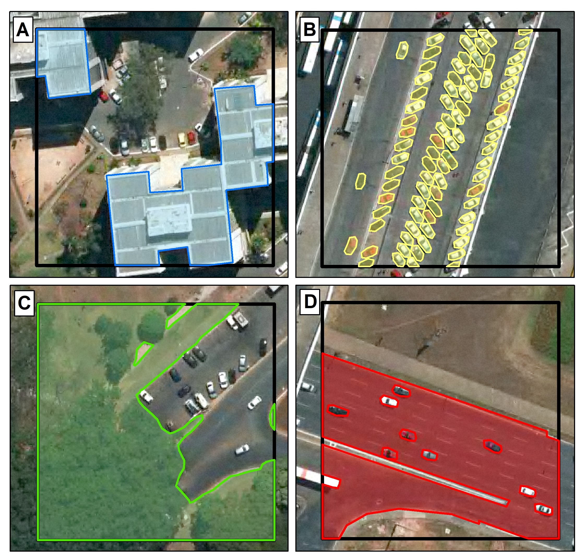

# SIAL: Sparse Annotation Framework for Semantic Segmentation via Iterative Active Learning

A complete framework for training high-quality semantic segmentation models using minimal point annotations through iterative active learning.

> **Note:** This paper has been submitted to **IEEE Journal of Selected Topics in Applied Earth Observations and Remote Sensing (JSTARS)** and is currently under review.

## Overview

SIAL introduces a paradigm shift from **uncertainty-driven** to **error-driven** active learning for semantic segmentation. Instead of querying samples where the model is uncertain, we directly target prediction errors through human-in-the-loop annotation.

**Key contributions:**
- **Error-driven active learning**: Annotators identify and correct model prediction errors iteratively
- **Extreme sparsity**: Only 1 pixel per class per image per iteration (~0.01% of dense supervision)
- **Error-Weighted Dice Loss (EWDL)**: A loss function that amplifies learning from misclassified pixels
- **Integrated framework**: Complete pipeline from annotation to training to evaluation


*Figure 1: SIAL framework overview showing the iterative active learning cycle.*

## How It Works

### 1. Sparse Point Annotation
Instead of dense polygon or pixel-wise annotation, SIAL uses sparse point annotations. Each click selects exactly one pixel per class.


*Figure 2: The annotation interface showing sparse point annotations overlaid on predictions.*

### 2. Error-Driven Selection
The annotator views model predictions and identifies errors (false positives and false negatives). New annotations are placed on misclassified regions.


*Figure 3: Iterative improvement showing prediction quality across iterations.*

### 3. Error-Weighted Dice Loss (EWDL)
EWDL amplifies gradients from misclassified pixels, forcing the model to prioritize correcting errors:

```
weight(x) = λ  if prediction is wrong
          = 1  if prediction is correct
```

With λ=5, error pixels contribute 5× more to the loss than correct pixels.

### 4. Iterative Refinement
Each iteration:
1. Train model on sparse annotations
2. Generate predictions
3. Annotator identifies errors and adds points
4. Repeat until convergence


*Figure 4: Performance comparison across iterations and methods.*

## Results

### Binary Segmentation (BSB Aerial Dataset)
| Setting | Car IoU | Road IoU | Building IoU | Perm. Area IoU |
|---------|---------|----------|--------------|----------------|
| Dense Supervision | 76.52% | 89.27% | 86.46% | 90.96% |
| **SIAL (6 iter)** | **72.29%** | **86.46%** | **80.55%** | **88.13%** |
| Random Selection | 39.74% | 77.07% | 73.06% | 85.13% |

### Multiclass Segmentation (ISPRS Vaihingen)
| Method | mIoU | Labeling Cost |
|--------|------|---------------|
| EasySeg (SOTA) | 72.83% | 0.015% |
| Full Supervised | 71.62% | 100% |
| **SIAL (Ours)** | **73.63%** | **0.009%** |

SIAL achieves **98% of dense performance** using only **0.01%** of labeled pixels.

## Installation

```bash
# Clone repository
git clone https://github.com/osmarluiz/SIAL.git
cd SIAL

# Install dependencies
pip install torch torchvision
pip install segmentation-models-pytorch
pip install PyQt5
pip install numpy pandas matplotlib imageio tqdm pyyaml
```

## Quick Start

1. **Open the notebook:**
   ```bash
   jupyter notebook active_learning_notebook.ipynb
   ```

2. **Configure your dataset** in Cell 2 (paths, classes, image size)

3. **Create a session** in Cell 3

4. **Annotate** (Cell 4): Launch the annotation tool, click on each class

5. **Train** (Cell 5): Train the model and generate predictions

6. **Iterate**: Repeat steps 4-5, identifying and correcting errors each time

## Dataset

The BSB Aerial dataset used in our experiments is available upon request. Please contact:

**Email:** osmarcarvalho@ieee.org

Include in your request:
- Your name and affiliation
- Intended use of the dataset
- Agreement to cite our paper in any publications

## Project Structure

```
SIAL/
├── active_learning_notebook.ipynb  # Main workflow notebook
├── src/
│   ├── annotation/      # Annotation launcher
│   ├── datasets/        # Dataset classes
│   ├── losses/          # EWDL and other losses
│   ├── session/         # Session management
│   ├── training/        # Training workflows
│   └── utils/           # Utilities
├── configs/
│   ├── datasets/        # Dataset configurations
│   └── training/        # Training configurations
├── annotation_interface/  # PyQt5 annotation tool
└── segmentation_models_pytorch/  # SMP with modifications
```

## Citation

If you use this code or framework in your research, please cite:

```bibtex
@article{carvalho2025sial,
  title={Sparse Annotation Framework for Semantic Segmentation via Iterative Active Learning},
  author={Carvalho, Osmar L. F. and others},
  journal={IEEE Journal of Selected Topics in Applied Earth Observations and Remote Sensing},
  year={2025},
  note={Under Review}
}
```

## License

This project is licensed under the MIT License - see the [LICENSE](LICENSE) file for details.

## Acknowledgments

- [Segmentation Models PyTorch](https://github.com/qubvel/segmentation_models.pytorch) for the backbone architectures
- ISPRS for the Vaihingen dataset
- The reviewers for their constructive feedback
